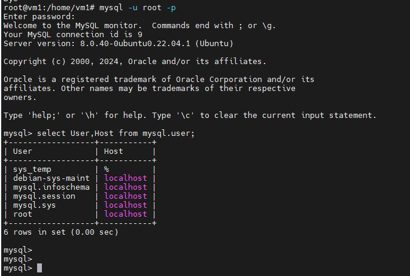
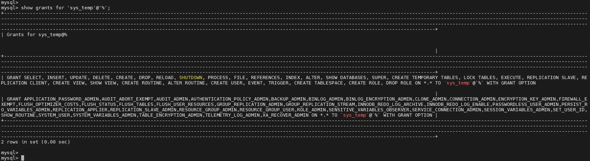
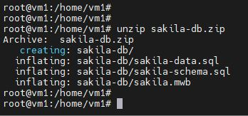
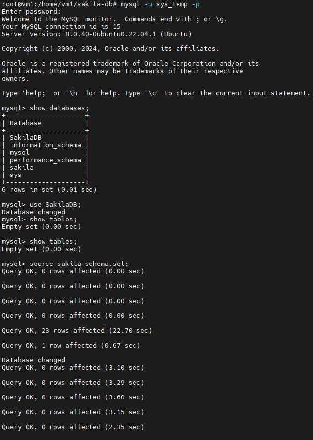
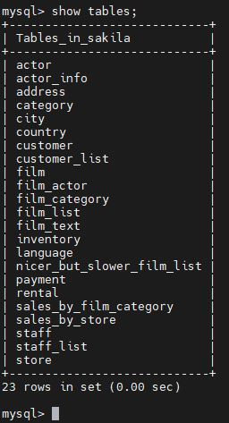

Домашнее задание к занятию "Работа с данными (DDL/DML)" - <Бычков Денис Вячеславович>

Задание 1
1.1. Поднимите чистый инстанс MySQL версии 8.0+. Можно использовать локальный сервер или контейнер Docker.

sudo apt update
sudo apt install gnupg
wget -c https://dev.mysql.com/get/mysql-apt-config_0.8.24-1_all.deb
sudo dpkg -i mysql-apt-config_0.8.24-1_all.deb
sudo apt update
sudo apt install -y mysql-server
sudo systemctl status mysql.service

1.2. Создайте учётную запись sys_temp.

mysql -u root -p 
create user 'sys_temp'@'%' identified by '12345678';
exit

1.3. Выполните запрос на получение списка пользователей в базе данных. (скриншот)

mysql -u root -p 
select User,Host from mysql.user;
exit

1.4. Дайте все права для пользователя sys_temp.

mysql -u root -p 
grant ALL PRIVILEGES on *.* to 'sys_temp'@'%' with GRANT option;
flush privileges;
exit

1.5. Выполните запрос на получение списка прав для пользователя sys_temp. (скриншот)

mysql -u root -p 
show grants for 'sys_temp'@'%';
exit

1.6. Переподключитесь к базе данных от имени sys_temp.

Для смены типа аутентификации с sha2 используйте запрос:

ALTER USER 'sys_test'@'localhost' IDENTIFIED WITH mysql_native_password BY 'password';

mysql -u sys_temp -p 
alter user 'sys_temp'@'%' IDENTIFIED with mysql_native_password by '12345678';
exit

1.6. По ссылке https://downloads.mysql.com/docs/sakila-db.zip скачайте дамп базы данных.

wget -c https://downloads.mysql.com/docs/sakila-db.zip
unzip sakila-db.zip
cd sakila-db

1.7. Восстановите дамп в базу данных.

mysql -u sys_temp -p
show databases;
create database SakilaDB;
show databases;
use SakilaDB;
show tables;
source sakila-schema.sql;
source sakila-data.sql;
show tables;
exit

1.8. При работе в IDE сформируйте ER-диаграмму получившейся базы данных. При работе в командной строке используйте команду для получения всех таблиц базы данных. (скриншот)

Результатом работы должны быть скриншоты обозначенных заданий, а также простыня со всеми запросами.

Задание 2
Составьте таблицу, используя любой текстовый редактор или Excel, в которой должно быть два столбца: в первом должны быть названия таблиц восстановленной базы, во втором названия первичных ключей этих таблиц. Пример: (скриншот/текст)

Название таблицы | Название первичного ключа
customer         | customer_id

Название таблицы           | Название первичного ключа
---------------------------|---------------------------
actor                      | actor_id
address                    | address_id
category                   | category_id
city                       | city_id
country                    | country_id
customer                   | customer_id
film                       | film_id
film_actor                 | actor_id, film_id
film_category              | film_id, category_id
film_text                  | film_id
inventory                  | inventory_id
language                   | language_id
payment                    | payment_id
rental                     | rental_id
staff                      | staff_id
store                      | store_id